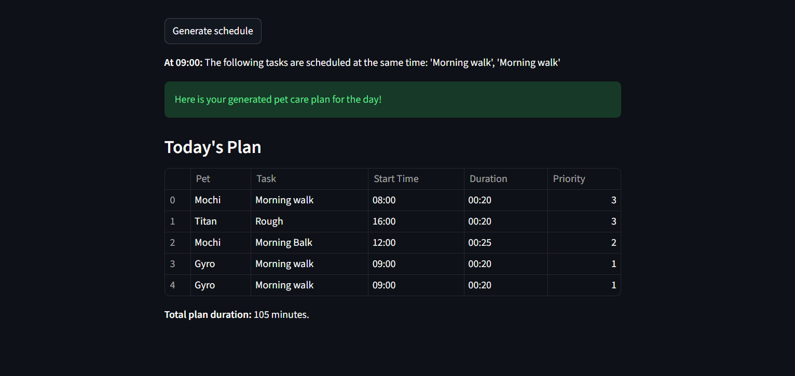

# PawPal+ (Module 2 Project)

You are building **PawPal+**, a Streamlit app that helps a pet owner plan care tasks for their pet.

## Scenario

A busy pet owner needs help staying consistent with pet care. They want an assistant that can:

- Track pet care tasks (walks, feeding, meds, enrichment, grooming, etc.)
- Consider constraints (time available, priority, owner preferences)
- Produce a daily plan and explain why it chose that plan

Your job is to design the system first (UML), then implement the logic in Python, then connect it to the Streamlit UI.

## What you will build

Your final app should:

- Let a user enter basic owner + pet info
- Let a user add/edit tasks (duration + priority at minimum)
- Generate a daily schedule/plan based on constraints and priorities
- Display the plan clearly (and ideally explain the reasoning)
- Include tests for the most important scheduling behaviors

## Getting started

### Setup

```bash
python -m venv .venv
source .venv/bin/activate  # Windows: .venv\Scripts\activate
pip install -r requirements.txt
```

### Suggested workflow

1. Read the scenario carefully and identify requirements and edge cases.
2. Draft a UML diagram (classes, attributes, methods, relationships).
3. Convert UML into Python class stubs (no logic yet).
4. Implement scheduling logic in small increments.
5. Add tests to verify key behaviors.
6. Connect your logic to the Streamlit UI in `app.py`.
7. Refine UML so it matches what you actually built.

### Smart Scheduling

The PawPal+ system includes several smart scheduling features to help you manage your pet care tasks effectively:

- **Conflict Detection**: The system automatically detects if multiple tasks are scheduled for the exact same start time on the same day and prints a warning. This helps prevent scheduling conflicts and ensures your plan is realistic.

- **Recurring Tasks**: When you mark a "daily" or "weekly" task as complete, a new instance of that task is automatically created for the next scheduled occurrence. Daily tasks are rescheduled for the next day, and weekly tasks for the next week, ensuring you never miss a recurring activity.

- **Flexible Sorting and Filtering**: You can easily organize and view your tasks with powerful sorting and filtering options. Tasks can be sorted by their start time or duration, and you can filter them based on their completion status or by the specific pet they belong to.

- **Time-Based Planning**: The scheduler generates a daily plan based on task priority and the total time you have available, ensuring that the most important tasks are always accounted for.

### Testing PawPal+

To run the built-in tests for PawPal+, use the following command in your terminal:

```bash
python -m pytest
```

The test suite in `tests/test_pawpal.py` covers the following key functionalities:

- **Task Completion**: Ensures that tasks can be correctly marked as complete.
- **Task Addition**: Verifies that new tasks can be successfully added to a pet.
- **Sorting Correctness**: Checks that tasks are sorted chronologically by their start time.
- **Recurrence Logic**: Confirms that completing a daily task correctly generates a new task for the following day.
- **Conflict Detection**: Verifies that the scheduler identifies and flags tasks that are scheduled for the same time.

- **Confidence Level**: ⭐⭐⭐⭐ (4 out of 5)

### 📸 Demo



