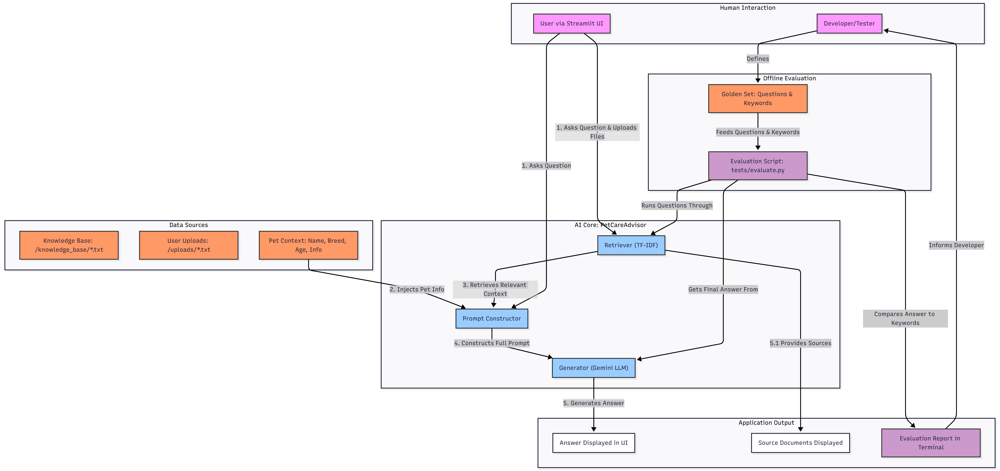
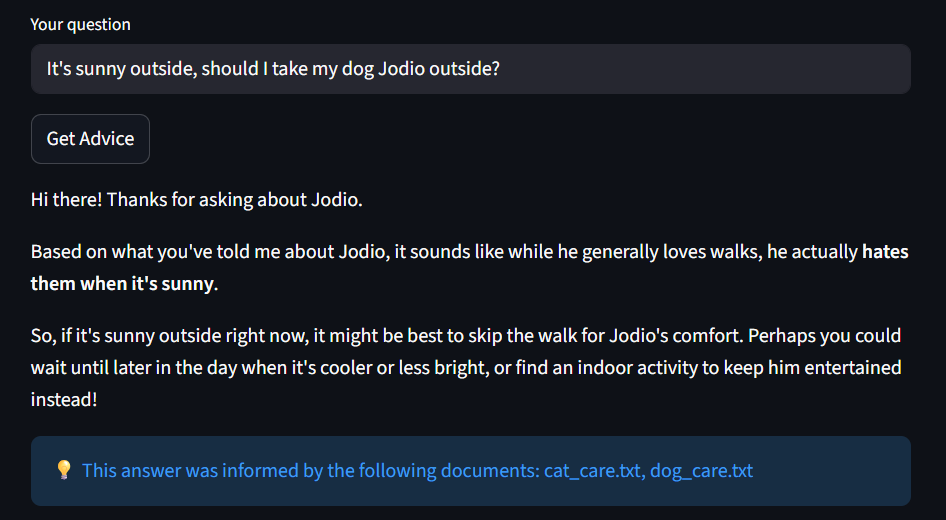
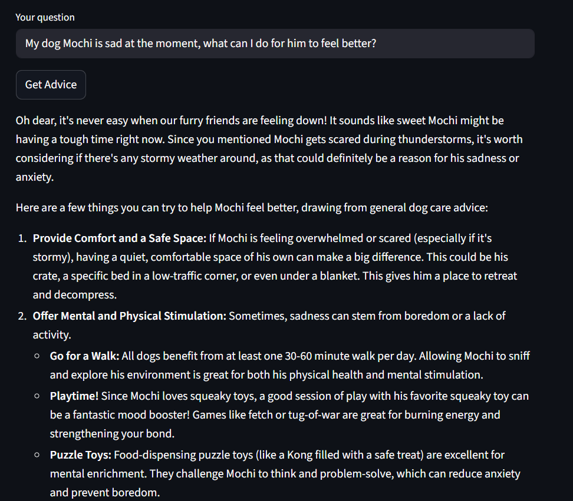
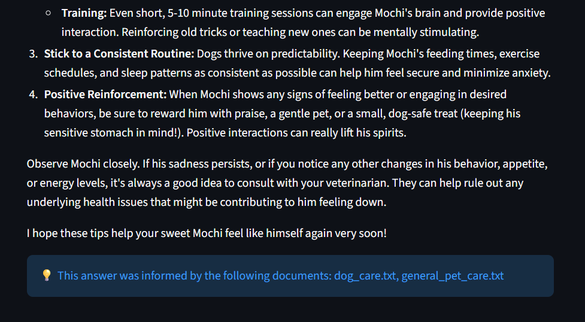
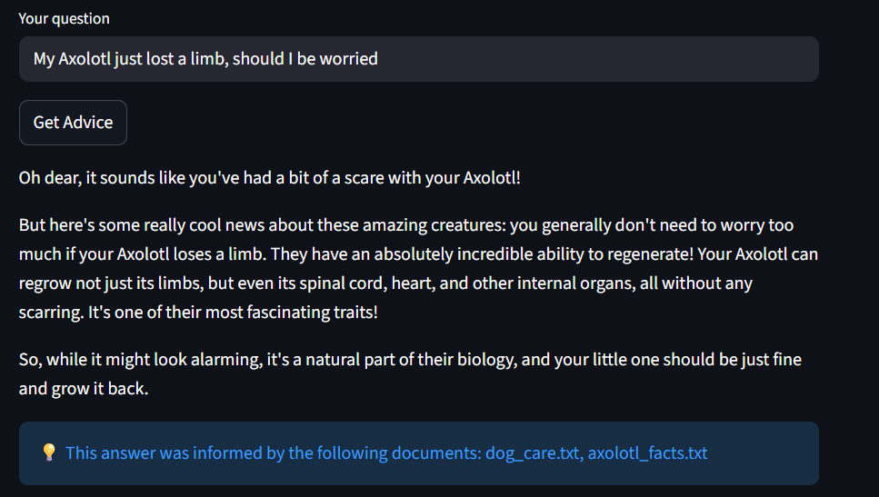

# PetCare AI

### Original Project: PawPal+

The original PawPal+ project was a task management system designed to help pet owners organize and schedule care-related activities for their pets. It allowed users to define tasks with specific attributes like duration, priority, and frequency, and then used a scheduler to generate a daily plan, identify conflicts, and manage recurring tasks.

### Summary

The PetCare AI  is a platform where you can ask any question about your pet, from how to make them happier to getting advice on a specific issue they're facing. If the advisor's answer isn't quite right, you can expand its knowledge by uploading your own documents. This is especially useful if your pet isn't a dog or cat, as the system's core knowledge is focused on them.

What makes this platform important is that it acts as a one-stop shop for pet care advice, saving you from endless Google searches and trying to piece together information from different websites. You can provide details about your specific pet and upload relevant files; the system then uses all this information to find the most relevant context and form an answer based on its combined knowledge. For example, as a dog owner, I can ask what I should do to improve my dog's wellness, and the system will tailor its advice using my dog's info and the knowledge base.

### Architecture Overview



The system is designed around a **Retrieval-Augmented Generation (RAG)** architecture. The process is as follows:

1.  A **user** asks a question through the Streamlit UI.
2.  The **Retriever** pulls relevant information from the static knowledge base and any user-uploaded files. Simultaneously, specific **pet context** (name, age, and general info) is gathered.
3.  This information is assembled by the **Prompt Constructor** into a comprehensive prompt, which is then sent to the **Gemini LLM**.
4.  The LLM **generates a synthesized answer**, which is displayed back to the user in the UI along with its sources.
5.  For testing, an offline **Evaluation Script** runs the system against a "golden set" of questions and keywords, providing a performance report based on keyword matches to guide improvements.

### Setup Instructions

1.  **Clone the Repository**
    ```bash
    git clone <your-repository-url>
    cd applied-ai-system-project
    ```

2.  **Create and Activate a Virtual Environment**
    ```bash
    # For Windows
    python -m venv venv
    .\venv\Scripts\activate

    # For macOS/Linux
    python3 -m venv venv
    source venv/bin/activate
    ```

3.  **Install Dependencies**
    Install all the required packages using the `requirements.txt` file.
    ```bash
    pip install -r requirements.txt
    ```

4.  **Set Up Your API Key**
    Create a file named `.env` in the root of the project directory and add your Google API key to it. The file should contain:
    ```
    GOOGLE_API_KEY="YOUR_API_KEY_HERE"
    ```

5.  **Run the Application**
    Launch the Streamlit application from your terminal.
    ```bash
    streamlit run app.py
    ```
    The application will open in your web browser.

### Sample Interactions

**Sample 1: General Question**


**Sample 2: Personalized Question**



**Sample 3: Question about a Non-Standard Pet**


### Design Decisions

**Core Architecture: Retrieval-Augmented Generation (RAG)**
*   **Decision**: Instead of relying solely on a generic Large Language Model, the system was built using a RAG architecture. It first *retrieves* relevant information from the knowledge base before *generating* an answer.
*   **Why**: This approach grounds the AI's responses in factual, user-provided documents, significantly reducing the risk of "hallucination" (making things up). We know where the information is coming from and can add to it at any time.
*   **Trade-off**: The effectiveness of the entire system hinges on the quality of the retrieval step. If the retriever fails to find the correct documents, the generator will not have the right information to form a good answer.

**Retrieval Method: TF-IDF and Cosine Similarity**
*   **Decision**: The system uses a classic information retrieval method, TF-IDF (Term Frequency-Inverse Document Frequency), to find relevant documents. It converts the user's question and the documents into numerical vectors and uses cosine similarity to find the best matches.
*   **Why**: We started with simple keyword matching, but it was too rigid. TF-IDF was chosen because it's a significant improvement in accuracy without adding the complexity of a full deep-learning-based vector database.
*   **Trade-off**: While better than keyword matching, TF-IDF doesn't understand semantics or the underlying meaning of words (e.g., it wouldn't know that "puppy" and "dog" are related).

**LLM Choice: Google Gemini via LangChain**
*   **Decision**: The system uses the `gemini-1.5-flash` model through the `langchain-google-genai` library.
*   **Why**: The project initially explored other options, but Gemini was selected for its strong balance of performance, speed, and ease of integration. The Gemini Flash model is both powerful and cost-effective for this type of chat application.
*   **Trade-off**: This choice introduces a dependency on an external API and requires an internet connection and a valid API key.

### Testing Summary

The system was evaluated using a combination of manual, interactive testing via the Streamlit UI and an automated script (`tests/evaluate.py`) that provides an objective measure of performance.

**How the Evaluator Works**

The evaluation script (`tests/evaluate.py`) operates on a "golden set" of predefined test cases. Each case includes a question, optional pet context, a list of expected keywords, and a pass threshold (e.g., 80%). For each test, the script calls the AI advisor and scores the response based on the percentage of expected keywords it contains. If the score meets or exceeds the threshold, the test passes. This provides a consistent and objective way to measure the impact of any changes to the prompt or retrieval logic.

**What Worked**
*   **Personalized Context Injection**: The mechanism for injecting the specific pet's details (name, age, breed, and general info) into the prompt worked reliably. This was a key success, as it allowed the advisor to provide personalized advice that directly referenced the user's pet, making the responses much more useful and engaging.
*   **Automated Evaluation Script**: Creating `evaluate.py` was crucial. It allowed for rapid, repeatable testing of any changes to the retrieval or generation logic. Being able to run a single command and see if the score improved or regressed made the process of testing prompts much more efficient.

**What Didn't Work**
*   **Initial Prompting Was Too Simplistic**: This was the biggest challenge. The first versions of the prompt were too direct, essentially just asking the AI to "answer the question using the context." This resulted in the AI simply finding the most relevant paragraph in the source text and copying it verbatim. The answers lacked synthesis and personality.
*   **Over-reliance on Retrieval**: Testing revealed that even with perfect context, a poor prompt would still lead to a poor answer. The system could retrieve a document about dog anxiety, but the AI wouldn't know how to apply it to "Mochi, a 2-year-old Corgi who is scared of thunder" without explicit instructions.

**Key Learnings**
I learned that proper AI integration is a core part of system design. From tuning prompts to modifying retrieval logic, I gained hands-on experience implementing a successful RAG system. I discovered that prompts require a balance: they must be specific, but not *too* specific. Sometimes, one small change is all it takes to get a reasonable output instead of a copy-pasted answer. It's all about instructing the LLM on *how* to use the documents provided.

### Reflection

This project taught me that using AI competently is a skill in itself. You can't just ask a question and expect a coherent answer; it's necessary to always provide context in some manner. The problem I solved with this in mind was how to properly fine-tune prompts so that the AI's interaction with the given context is meaningful.

In general, this project reinforced the value of an incremental approach to problem-solving. By breaking the system down into parts and solving each part individually, I was able to move closer and closer to the final goal.
